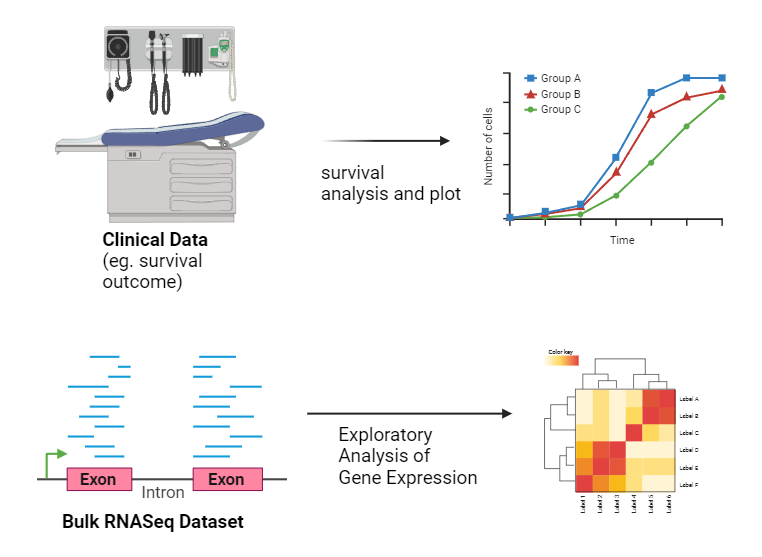

<!-- README.md is generated from README.Rmd. Please edit that file -->

```{r, include = FALSE}
knitr::opts_chunk$set(
  collapse = TRUE,
  comment = "#>",
  fig.path = "man/figures/README-",
  out.width = "100%"
)
```

# ClinicalTranscriptLink

<!-- badges: start -->
<!-- badges: end -->

## Description

`ClinicalTranscriptLink` is a package that aims to identify correlations between clinical expression of cancers and the transcriptional expression of genes using bulk RNA sequencing data. Packages currently available only study one of these and do not provide much correlation between the clinical expression of diseases and the corresponding gene expression. As such, this package aims to create that link to help us better understand the relation. Specifically, the package aims to study: 
- 1) the type of cancer and its relation to gene expression
- 2) the survival analysis of different types of cancer

This package contains functions to perform analysis as well as visualisation of the above two goals. The `ClinicalTranscriptLink` package was developed using `R version 4.3.1 (2023-06-16)`, `Platform: x86_64-w64-mingw32/x64 (64-bit)` and `Running under: Windows 11 x64 (build 22631)`.

## Installation

You can install the development version of ClinicalTranscriptLink from [GitHub](https://github.com/) with:

``` r
# install.packages("devtools")
devtools::install_github("michellemlin/ClinicalTranscriptLink", build_vignettes = TRUE)
library(ClinicalTranscriptLink)
```

To run the Shiny app: under construction

## Overview
For an example of use of ClinicalTranscriptLink: 

```r
ls("package:ClinicalTranscriptLink")
data(package = "ClinicalTranscriptLink") 
browseVignettes("ClinicalTranscriptLink")
```

`ClinicalTranscriptLink` provides the following functions at the moment: 

- `metadataExtract` : a function that allows users to extract         metadata from from clinical data
  
- `SurvivalMapVis` : a function that allows users to conduct survival analysis using package `survival`

- `survivalExplore` : a function that allows users to explore metadata through visualisations




## Contributions
This package was created by `Michelle Lin` and contains functions found in packages `survival`, `survminer`, `dplyr` for survival analysis and `DESeq2` that will be used for differential expression analysis.


## References
- H. Wickham. ggplot2: Elegant Graphics for Data
  Analysis. Springer-Verlag New York, 2016.
  
- Kosinski M (2023). _RTCGA.clinical: Clinical
  datasets from The Cancer Genome Atlas Project_.
  doi:10.18129/B9.bioc.RTCGA.clinical
  <https://doi.org/10.18129/B9.bioc.RTCGA.clinical>, R
  package version 20151101.30.0,
  <https://bioconductor.org/packages/RTCGA.clinical>.
  
- Kosinski M (2023). _RTCGA.rnaseq: Rna-seq datasets
  from The Cancer Genome Atlas Project_.
  doi:10.18129/B9.bioc.RTCGA.rnaseq
  <https://doi.org/10.18129/B9.bioc.RTCGA.rnaseq>, R
  package version 20151101.30.0,
  <https://bioconductor.org/packages/RTCGA.rnaseq>.
  
- Love, M.I., Huber, W., Anders, S. Moderated estimation of fold
  change and dispersion for RNA-seq data with DESeq2 Genome
  Biology 15(12):550 (2014)
  
- R Core Team (2023). _R: A Language and Environment for Statistical Computing_.
  R Foundation for Statistical Computing, Vienna, Austria.
  <https://www.R-project.org/>
  
- Therneau T (2023). _A Package for Survival Analysis in R_. R
  package version 3.5-5,
  <https://CRAN.R-project.org/package=survival>.
  
- Kassambara A, Kosinski M, Biecek P (2021). _survminer: Drawing
  Survival Curves using 'ggplot2'_. R package version 0.4.9,
  <https://CRAN.R-project.org/package=survminer>.

- Wickham H, Francois R, Henry L, Muller K, Vaughan D (2023).
  _dplyr: A Grammar of Data Manipulation_. R package version
  1.1.3, <https://CRAN.R-project.org/package=dplyr>.


## Acknowledgements
This package was developed as part of an assessment for Fall 2023 BCB410H1: Applied Bioinformatics course at the University of Toronto, Toronto, CANADA. ClinicalTranscriptLink welcomes issues, enhancement requests, and other contributions. To submit an issue, use the GitHub issues.

